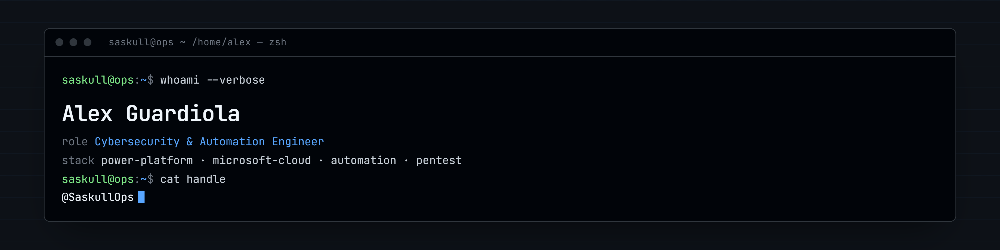

## Hey there, I'm Alex 👋

I'm a cybersecurity learner and automation engineer transitioning from the Microsoft ecosystem (Power Platform, M365) into infosec. I document my journey through CTFs, labs, and technical experiments.

### 🔐 What I'm working on

- 🎯 Completing TryHackMe rooms and publishing detailed write-ups
- 📚 Building practical skills in offensive security and SOC operations
- 🛠️ Automating security workflows with Python and PowerShell
- 📝 Blogging at [saskullops.github.io](https://saskullops.github.io)

### 🧰 Tech stack

**Security**: Metasploit • Burp Suite • Wireshark • Nmap • John the Ripper  
**Cloud & Automation**: Azure • Power Platform • Power Automate • M365  
**Languages**: Python • PowerShell • Bash • JavaScript

### 📫 Find me online

- 💼 [LinkedIn](https://linkedin.com/in/àlex-guardiola-martínez-67a5a8133)
- 📖 [Blog](https://saskullops.github.io)
- 📧 a.guardiola.m@gmail.com

---

*Currently learning: penetration testing methodologies, SOC operations, and threat hunting*
